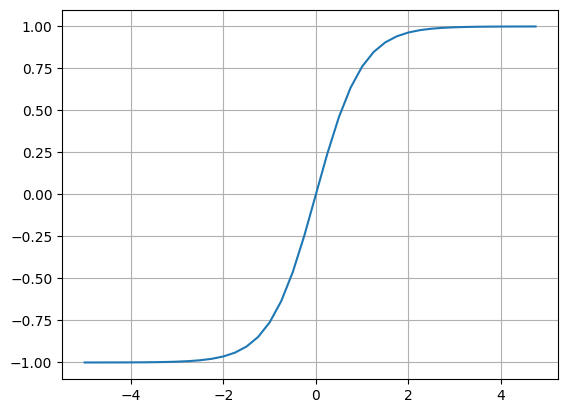
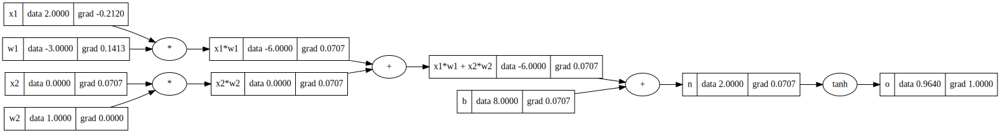

# Autograd

A tiny scalar-valued automatic gradient engine that implements backpropagation from scratch on a neural network / MLP. Potentially for learning purpose.

## Libraries Used

- numpy
- matplotlib
- graphviz
- pytorch

## Approach

Created a class named `Value` for scalers that keeps track of its children, operations, and gradients for backpropagation.

Gradients calculated by the engine are verified manually using the definition of derivative, and using `Pytorch`.

**tanh()** is used as an activation function that squeezes the final output between (-1, 1).

Graphs are generated using `graphviz` for visual understanding of every operation.

